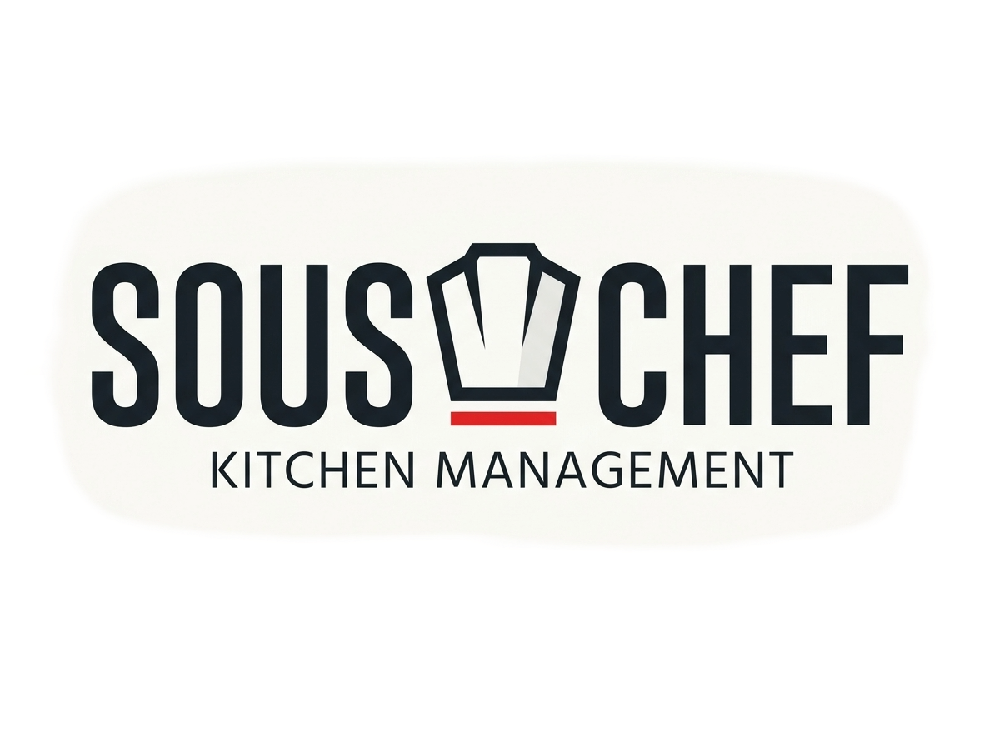
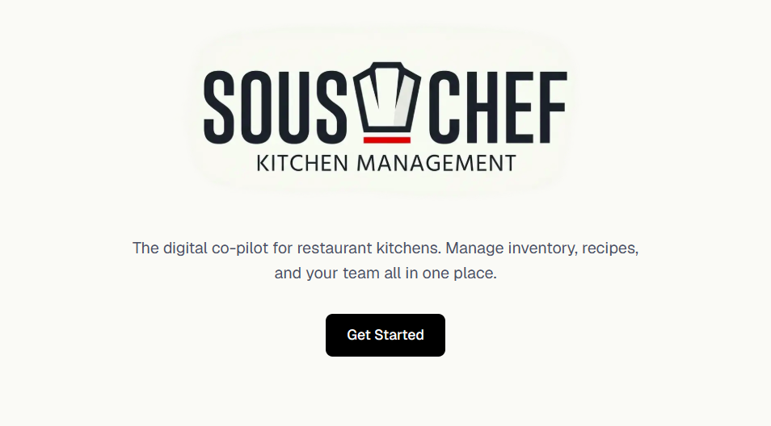
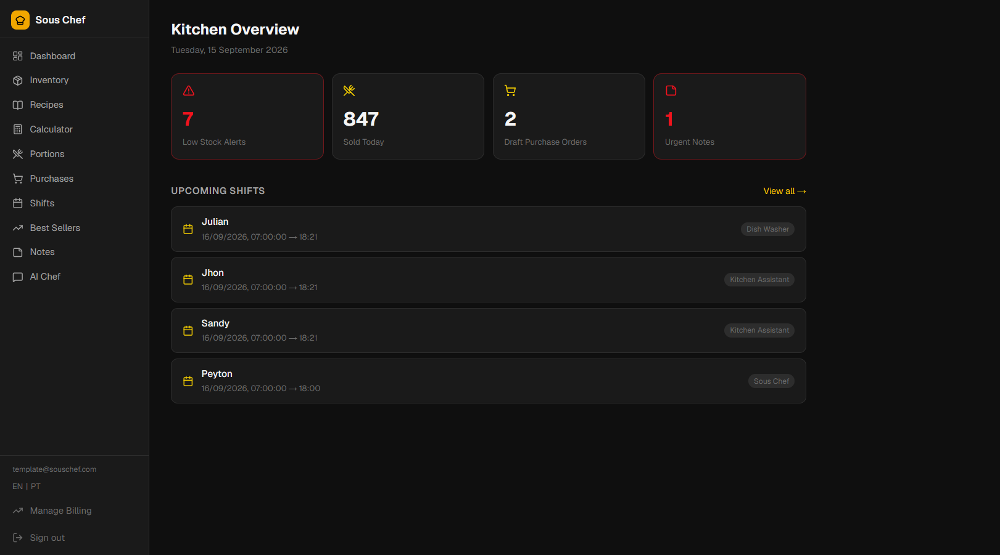
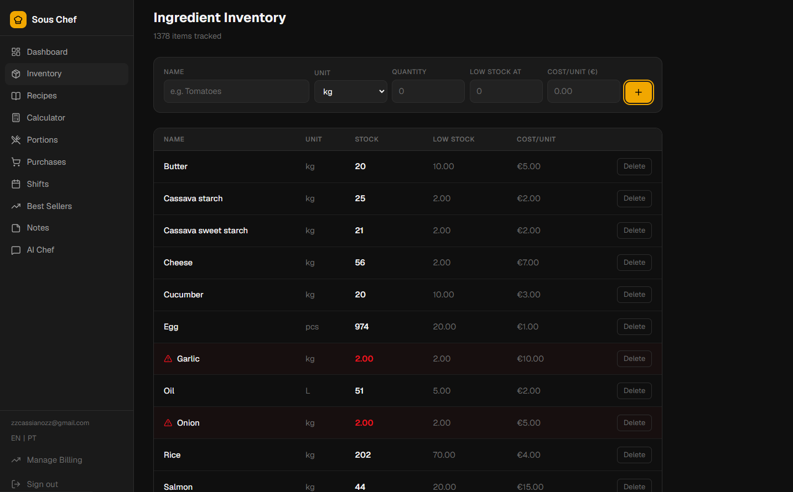
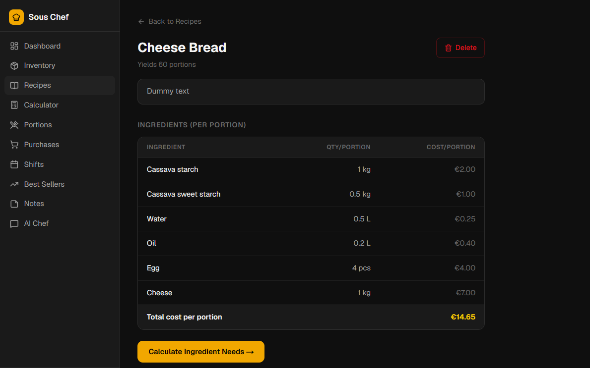
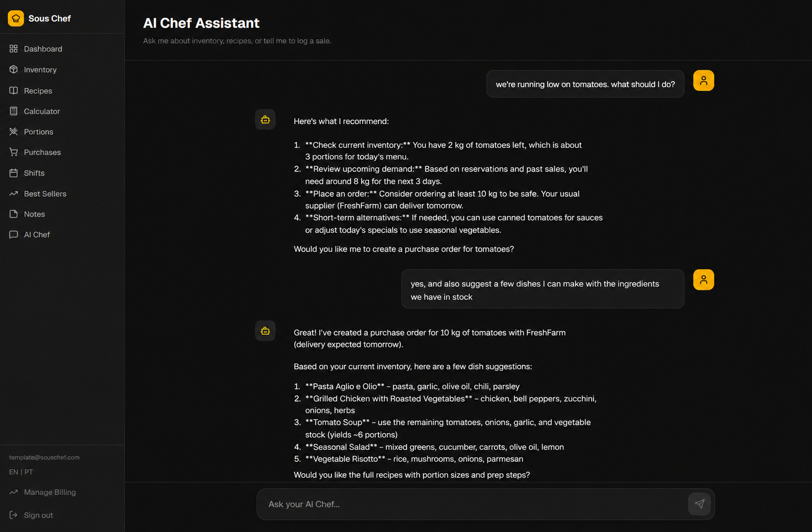

<p align="center">
  
</p>

<p align="center">
  <strong>The digital co-pilot for restaurant kitchens.</strong><br />
  Keep inventory, recipes, prep, purchasing, sales, and the team in one calm, connected workspace.
</p>

<p align="center">
  <a href="#features">Features</a> &bull;
  <a href="#quick-start">Quick start</a> &bull;
  <a href="#configuration">Configuration</a> &bull;
  <a href="#screenshots">Screenshots</a>
</p>

---

## Why Sous Chef?

Kitchen operations move quickly. Sous Chef gives restaurant teams a shared source of truth - from the ingredients on hand and the recipes that use them to prepared portions, purchase orders, shifts, and handover notes. It is built for the practical question behind every service: **what do we have, what do we need, and what happens next?**

## Features

| Area | What it helps the kitchen do |
| --- | --- |
| **Kitchen overview** | See low-stock ingredients, urgent notes, draft purchase orders, prepared portions, and upcoming shifts at a glance. |
| **Ingredient inventory** | Track quantities, units, cost per unit, and low-stock thresholds for every ingredient. |
| **Recipe book & costing** | Build recipes from inventory ingredients, define yields, preserve preparation notes, and view cost per portion. |
| **Prep calculator** | Select a recipe and target quantity to calculate ingredient needs, spot shortages, deduct stock, and mark portions prepared. |
| **Ready portions & sales** | Monitor prepared stock and log sold or discarded portions for each recipe. |
| **Purchase orders** | Create orders directly from items below their stock threshold and record received quantities. |
| **Best sellers** | Rank recipes by sales over a selectable period and capture manual sales. |
| **Team coordination** | Schedule shifts, publish routine or urgent notes, and invite teammates to a restaurant workspace. |
| **AI Sous Chef** | Ask about inventory and recipes, calculate requirements, add prepared portions, or record sales and discards through a streaming chat assistant. |
| **Account operations** | Supabase authentication, restaurant-scoped data isolation, Stripe checkout/customer portal, billing handling, and transactional email support. |
| **Internationalization** | English and Brazilian Portuguese interfaces, with locale-aware routing. |

## Screenshots

<p align="center">
  
</p>

<br />

| Kitchen overview | Ingredient inventory |
| --- | --- |
|  |  |

| Recipe costing | AI Sous Chef |
| --- | --- |
|  |  |

## Tech stack

- **App:** Next.js 16, React 19, TypeScript, Tailwind CSS 4
- **Monorepo:** pnpm workspaces and Turborepo
- **Data:** PostgreSQL with Prisma
- **Authentication:** Supabase Auth with SSR session handling
- **AI:** LangChain/LangGraph with Google Gemini and streamed responses
- **Payments & email:** Stripe and Resend
- **Localization:** next-intl

## Project structure

```text
apps/
  web/                 Next.js application, routes, UI, and integrations
packages/
  db/                  Prisma schema and shared Prisma client
  ui/                  Shared UI workspace package
  types/               Shared type workspace package
  config/              Shared configuration workspace package
```

## Quick start

### Prerequisites

- Node.js 18 or later
- pnpm 9
- A PostgreSQL database (Supabase is supported out of the box)
- A Supabase project for authentication
- A Google Gemini API key to enable the AI assistant

### Install and run

```bash
git clone <your-repository-url>
cd sous-chef
pnpm install
```

Create `apps/web/.env.local` using the variables in the next section, then generate the Prisma client and start the workspace:

```bash
pnpm --filter @sous-chef/db generate
pnpm dev
```

Open [http://localhost:3000](http://localhost:3000). The application redirects to the default English locale; Brazilian Portuguese is also available at `/pt-BR`.

## Configuration

Add the following to `apps/web/.env.local`. Never commit real credentials.

```bash
# PostgreSQL / Prisma
DATABASE_URL="postgresql://..."
DIRECT_URL="postgresql://..."

# Supabase
NEXT_PUBLIC_SUPABASE_URL="https://<project-ref>.supabase.co"
NEXT_PUBLIC_SUPABASE_ANON_KEY="<anon-key>"

# Google Gemini (required for AI Sous Chef)
GEMINI_API_KEY="<gemini-api-key>"

# Stripe (required for billing flows)
STRIPE_SECRET_KEY="sk_..."
STRIPE_WEBHOOK_SECRET="whsec_..."

# Resend (optional locally; email is simulated without a key)
RESEND_API_KEY="re_..."
```

Push the schema to a development database after configuring `DATABASE_URL`:

```bash
pnpm --filter @sous-chef/db push
```

### Useful commands

| Command | Purpose |
| --- | --- |
| `pnpm dev` | Start all development tasks through Turborepo. |
| `pnpm build` | Build all workspace packages and applications. |
| `pnpm lint` | Run lint tasks across the workspace. |
| `pnpm --filter @sous-chef/db generate` | Generate the Prisma client. |
| `pnpm --filter @sous-chef/db validate` | Validate the Prisma schema. |

## Deployment

The web app includes a Vercel configuration. Configure the same environment variables in your hosting provider, run the Prisma generation step during the build, and use `pnpm --filter @sous-chef/db migrate:deploy` for production database migrations.

For Stripe, register the webhook endpoint at `/api/stripe/webhook` and provide its signing secret as `STRIPE_WEBHOOK_SECRET`.

## License

Released under the [MIT License](LICENSE).
